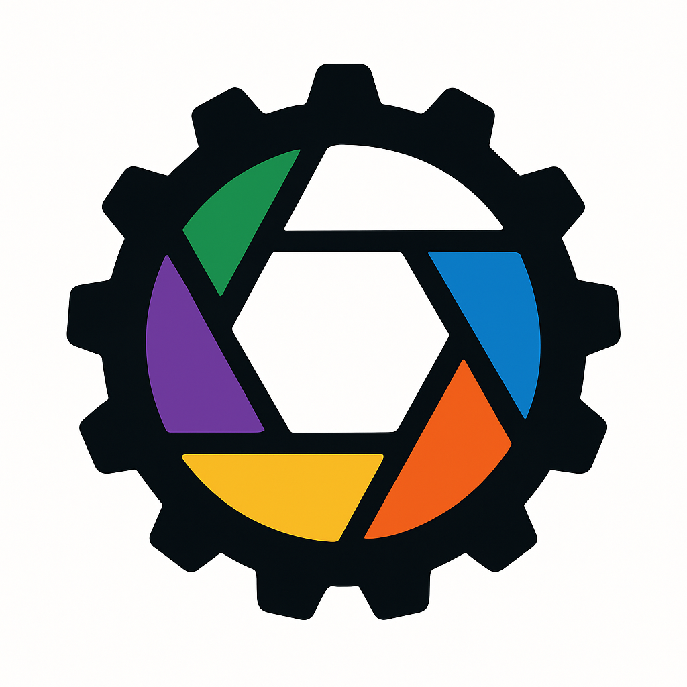

<p align="center" style="font-size: 2.5em">
    Photo
</p>
<p align="center">
    
</p>
<p align="center" style="font-size: 1.5em">
    A lightweight, highly-generic Rust library for image manipulation with rich format support and transformation operations.
</p>

[](https://crates.io/crates/photo)
[](https://docs.rs/photo)
[](https://opensource.org/licenses/MIT)

## Features

- **Multiple Image Formats**: Complete support for grayscale, grayscale with alpha, RGB, and RGBA images
- **Type Flexibility**: Generic implementation for various component types (`u8`, `f32`, `f64`, etc.)
- **Image Manipulation**: Comprehensive operations for regions, borders, and transformations
- **Tiling Operations**: Create, extract and compose image tiles with or without overlaps
- **Image Composition**: Stack images horizontally and vertically
- **Advanced Indexing**: Access and modify pixels and channels with ease
- **Comprehensive Testing**: High test coverage ensures library reliability
- **Minimal Dependencies**: Core functionality relies on few, well-maintained dependencies
- **PNG Support**: Read from and write to PNG image files

## Installation

Add this to your `Cargo.toml`:

```toml
[dependencies]
photo = "3.0.0"
```

## Usage

### Basic Image Operations

```rust
use photo::{Channels, Image};

// Create a new empty RGB image with f32 components
let mut image = Image::<f32>::empty((100, 100), Channels::RGB);

// Fill an image with a specific color
let red_image = Image::<f32>::filled((50, 50), &[1.0, 0.0, 0.0]);

// Access and modify pixel values
let pixel = image.get_pixel((10, 10));
image.set_pixel((20, 20), &pixel);

// Get a specific channel
let red_channel = image.get_channel(0);
```

### Image Transformations

```rust
use photo::Image;

// Create a new image from multiple layers
let layers = vec![red_layer, green_layer, blue_layer];
let mut image = Image::from_layers(&layers);

// Move pixels around (with wrapping)
image.slide_inplace((10, -5));

// Copy a region of the image
let region = image.copy_region((0, 0), (50, 50));
```

### Working with Tiles

```rust
use photo::Image;

// Split an image into tiles (non-overlapping)
let tile_size = (32, 32);
let no_overlap = (0, 0);
let tiles = image.copy_tiles(tile_size, no_overlap);

// Create an image from a grid of tiles
let combined_image = Image::stack(&tiles);

// Extract tiles with overlap
let overlap = (4, 4);
let overlapping_tiles = image.copy_tiles(tile_size, overlap);
```

### Working with Borders

```rust
use photo::Image;
use nav::Direction;

// Get a view of the border regions
let north_border = image.view_border(&Direction::North, 5);
let south_border = image.view_border(&Direction::South, 5);

// Copy border regions
let east_border = image.copy_border(&Direction::East, 5);
let west_border = image.copy_border(&Direction::West, 5);

// View or copy the interior (excluding borders)
let interior = image.copy_interior(5);
```

### Composing Images

```rust
use photo::Image;

// Stack images vertically
let vertical_stack = Image::vstack(&[image1, image2, image3]);

// Stack images horizontally
let horizontal_stack = Image::hstack(&[image1, image2, image3]);
```

## Applications

This library is useful for:

- Image processing and manipulation
- Computer vision
- Pattern recognition
- Procedural texture generation
- Image-based machine learning
- Tile-based graphics
- Cellular automata and grid-based simulations

## License

This project is licensed under the MIT License - see the [LICENSE](LICENSE) file for details.
