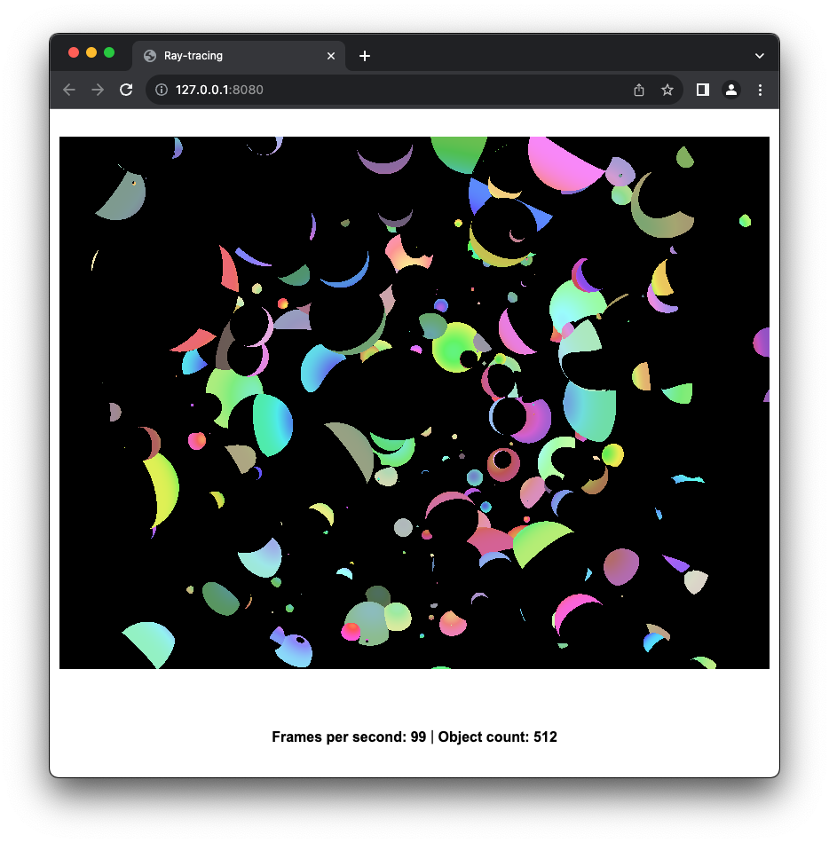

# Photo

Ray-tracing renderer with WebGPU and TypeScript.
[](https://freddywordingham.github.io/Photo/)

## Quickstart

Download the repository and set the current directory to the root of the repository:

```bash
git clone https://github.com/FreddyWordingham/Photo.git photo
cd photo
```

Install all dependencies and run:

```bash
npm run start
```
